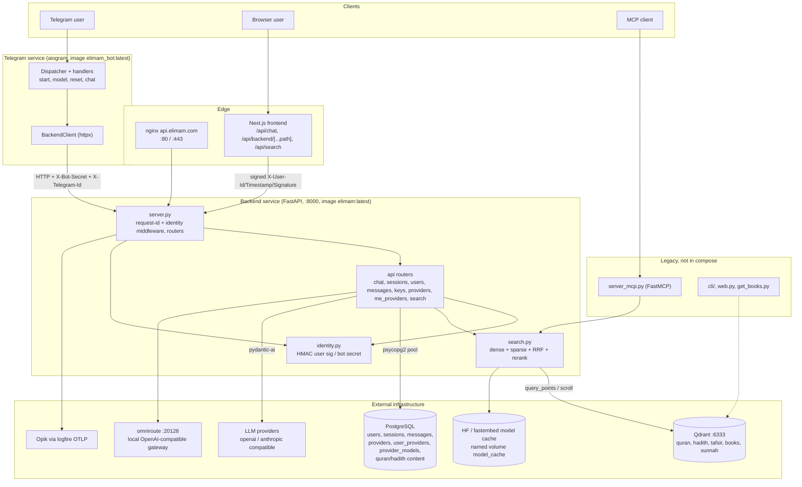

# System Architecture

Major components and how they talk.

Key points:

- There is exactly one search layer (`search.py`) and one identity layer (`identity.py`).
- The bot is transport only: it never opens the DB or Qdrant, only `BackendClient` HTTP.
- Backend publishes no host port; nginx and the Next.js proxy are the only entries.
- Postgres and Qdrant are external to compose (`.env`: `DATABASE_*`, `QDRANT_URL`).
- `providers` (DB table) is the model catalog source of truth — no YAML at runtime.
