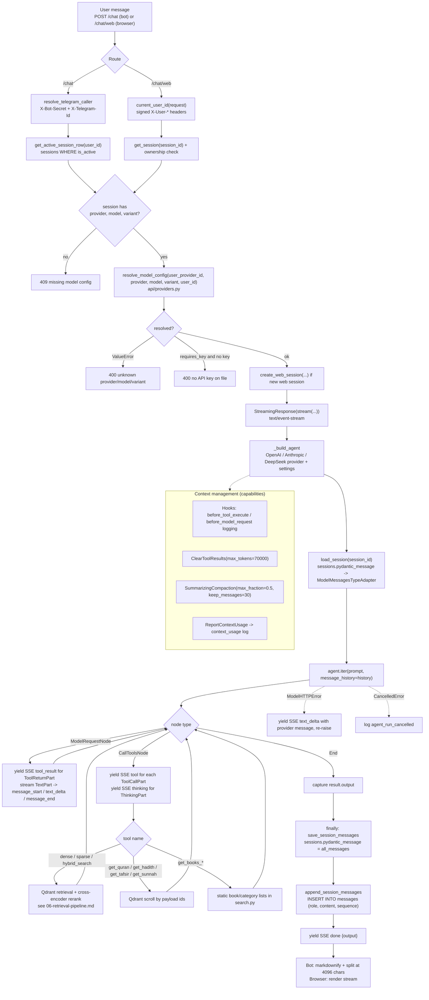

# Agent Workflow

What happens from a user question to the answer.

Notes:

- Tools are a `FunctionToolset` of 11 functions, all from `search.py`; the system prompt is `skills/turath-index-skill.md` (read at import, relative path).
- Two persistence targets per turn: `sessions.pydantic_message` (full pydantic-ai history, the resumption source) and `messages` rows (projected role/content, sequence computed in the INSERT subquery).
- `retries=3` on the Agent; tool errors are returned to the model as `ToolReturnPart`s (`search.py` catches `Exception` and returns `[{"error": ...}]`).
