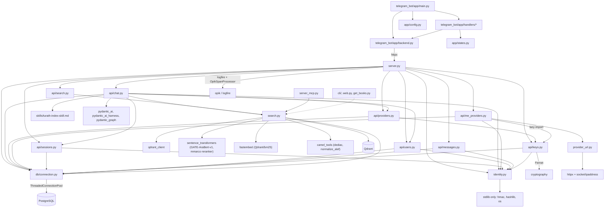

# Function / Module Dependency

Which modules import which. Arrows point at the dependency.

Import-time coupling (the reason tests need the stack):

| Module | Side effect at import |
| --- | --- |
| `db/connection.py` | builds the psycopg2 pool from `DATABASE_*` in `.env` |
| `search.py` | loads GATE-AraBert-v1, the cross-encoder and BM25, connects to Qdrant |
| `api/chat.py` | calls `setup_indexes()` and reads `./skills/turath-index-skill.md` |
| `api/providers.py` | lazy — reads the `providers` table on first use, then caches in-process |
| `identity.py`, `provider_url.py` | pure, no DB/model imports (unit-testable standalone) |
