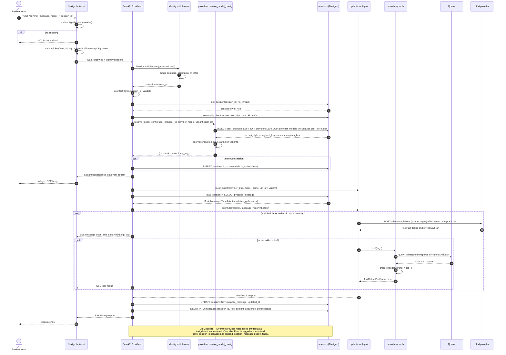
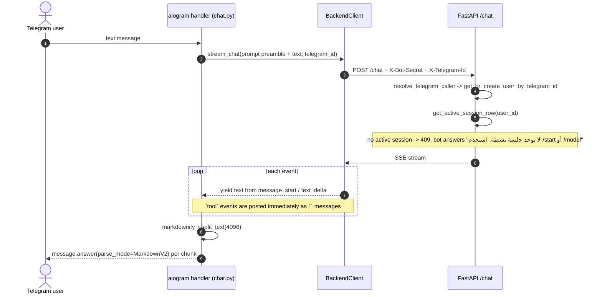
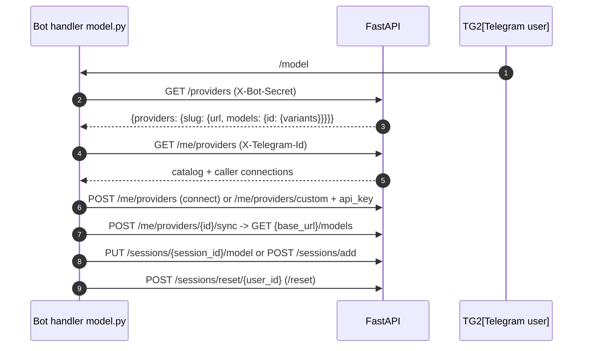

# Sequence Diagram

Exact order of interactions for one web chat turn (bot turn differs only in the first two arrows).

Telegram variant of the first steps:

Model-selection flow (`/model`) writes through the same auth path:

