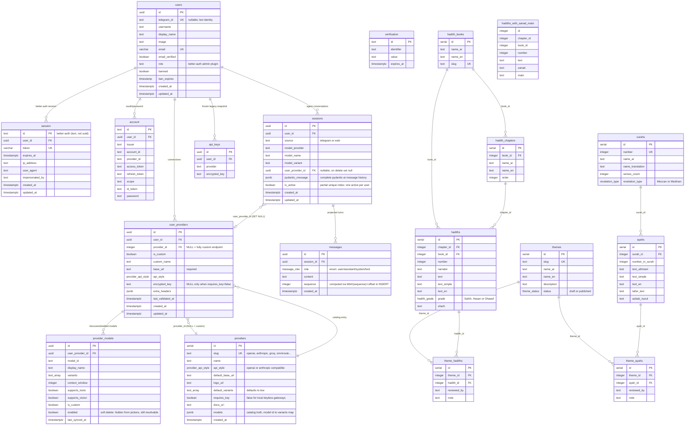

# ER Diagram — PostgreSQL

Source of truth: `frontend/src/db/schema.ts` (Drizzle). The backend has no DDL and no migrations; it queries these tables with raw psycopg2 SQL.

Two "session" tables, and they are unrelated:

- `session` / `account` / `verification` / `verification` = Better Auth (web login). `session.id` is **text**, ids come from `crypto.randomUUID()`.
- `sessions` = agent conversations the backend owns (`user_id`, model triple, `pydantic_message`). `messages.session_id` points here, not at `session`.

Other constraints worth remembering:

- `sessions_one_active_per_user_idx` is a partial unique index on `(user_id) WHERE is_active = true`. Web sessions insert with `is_active = false` to stay out of it.
- `user_providers` has a unique index on `(user_id, provider_id)`; NULLs never collide, so a user can hold unlimited custom connections but one per catalog provider.
- `api_keys` is frozen (rollback snapshot for the `user_providers` migration) — never read or written by current code.
- `hadiths_with_sanad_matn` is created outside Drizzle and read-only.
