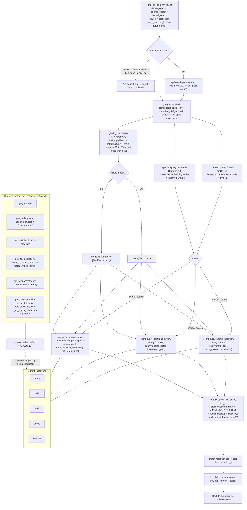

# Retrieval Pipeline

How query → embedding → hybrid search → reranking works in `search.py`.

Details that matter:

- **Model load is `lru_cache(maxsize=1)`** on `load_model` / `ranker_loader`; the first call prints `Loading Model`. Both are loaded at import.
- **Vectors are never returned** (`with_vectors=False`) — only payloads, which keeps tool results small enough for the context window.
- **`rerank_pool` is the only knob that controls recall** (Qdrant candidate count). `top_k` only slices after reranking, so `top_k` alone cannot improve recall.
- **RRF (Reciprocal Rank Fusion)** is done inside Qdrant via `FusionQuery(fusion=Fusion.RRF)`, not in Python.
- **Errors are swallowed into the result**: every search function catches `Exception` (not `ValueError`) and returns `[{"error": "Type: message"}]` so the agent can react instead of the SSE stream dying.
- `setup_indexes()` (called at `api/chat.py` import) creates the payload indexes for `ids` plus every filterable field per collection — `create_payload_index` is idempotent, so this runs on every boot.
- Collections live in gitignored `qdrant_storage/` and are populated by `notebooks/update_db.ipynb`; there is no seeding code in the running service except `vectordb/seed_*.py` scripts.

Filter field map (from `setup_indexes`):

| Collection | Filterable payload fields |
| --- | --- |
| quran | surah_number, surah |
| hadith | book, grade |
| tafsir | surah_number, surah, ayah_number |
| books | book_id, book_name, category_name, all_authors, author_death, book_date |
| sunnah | book_id, book_name, category_name, all_authors, author_death, book_date, athar_number |
