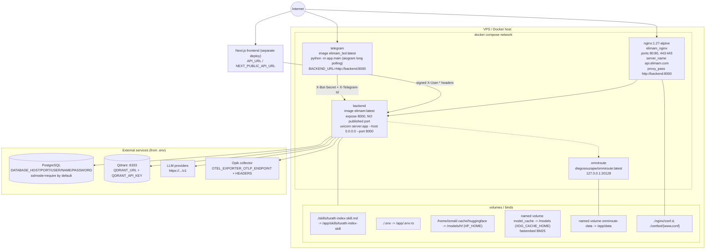
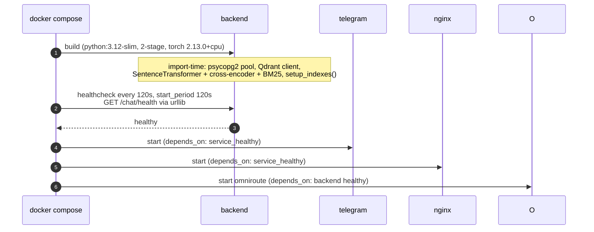

# Deployment

`docker compose up` from `backend/` runs backend + telegram bot + nginx + omniroute. Postgres and Qdrant are external.

Startup ordering and gating:

Deployment facts and risks:

- **Image build**: multi-stage `python:3.12-slim`; `requirements.txt` (not `pyproject.toml`) is what the Dockerfile installs; `torch==2.13.0+cpu` comes from the PyTorch CPU extra index.
- **Health endpoint** is `/chat/health` (not `/health`), and `/chat` is in `PUBLIC_PATHS` so it works before identity rollout.
- **No port on backend** — reachable only inside the compose network as `http://backend:8000` (nginx, bot, and the Next.js deploy must be on that network or a tunnel).
- **Model cache is the slow bit**: first boot downloads GATE-AraBert-v1 into the HF bind mount; `start_period: 120s` exists for exactly that.
- **`HF_HOME=/models/hf`** and **`XDG_CACHE_HOME=/models/cache`** keep the HF and fastembed caches inside mounted volumes so a restart is not a re-download.
- Required secrets in `.env`: `TELEGRAM_BOT_TOKEN`, `BOT_SHARED_SECRET` (must be identical in both services), `ENCRYPTION_MASTER_KEY`, `USER_SHARED_SECRET` (shared with the Next.js proxy), plus `DATABASE_*`, `QDRANT_*`, `OTEL_*`.
- `docker-compose.yaml.tmp` and `telegram_bot/Dockerfile.tmp` are leftovers, not used by `up`.
- `heroku.yml` exists but the compose file is the live deployment.
- `AUTH_MODE` (default `permissive`) is the rollout switch; set `enforce` when no pre-migration clients remain.
