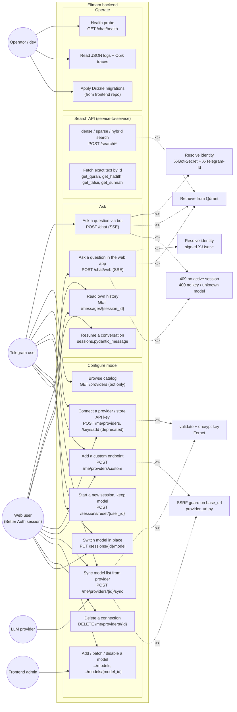

# Use Case Diagram

What each type of actor can do.

Actor notes:

| Actor | How it authenticates | What it can reach |
| --- | --- | --- |
| Telegram user | bot holds `BOT_SHARED_SECRET`, forwards `X-Telegram-Id` | everything the bot exposes: chat, `/keys` shim, sessions, `/me/providers` |
| Web user | Next.js server signs `X-User-Id:X-User-Timestamp` with `USER_SHARED_SECRET` (5 min window) | `/chat/web`, `/sessions`, `/messages`, `/me/providers`, and `/keys` under the allowlist in the Next proxy |
| LLM provider | n/a (outbound) | answers `{base_url}/models` for discovery and chat completions |
| Operator / dev | host access + `.env` | health, logs, traces, DB migrations |
| Frontend admin | `users.role` + ban columns (Better Auth admin plugin) | user management lives in the frontend, not here |

Not reachable from the browser by design: `/providers` (bot-secret only), `/users/add` and `/users/telegram/link` (`require_bot`), and any `/me/*` path other than `/me/providers` (Next.js proxy allowlist).
