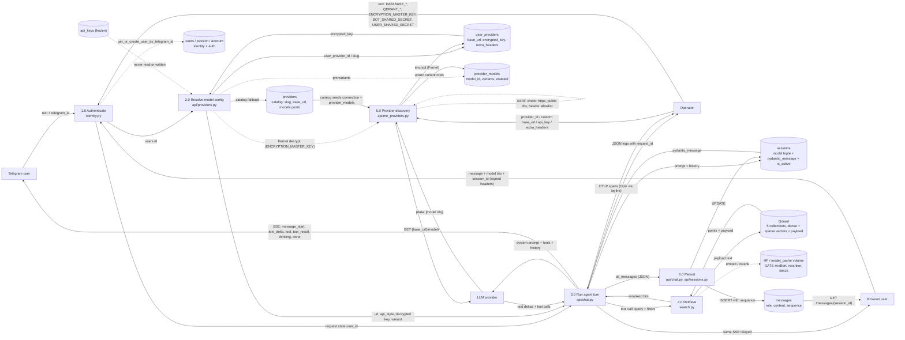

# Data Flow Diagram (DFD)

Where data enters, moves, transforms, and gets stored.

Trust boundaries (where data is hostile and must be validated):

| Boundary | Incoming data | Control |
| --- | --- | --- |
| Internet → `/chat`, `/chat/web` | message text, model trio, session id | identity middleware, UUID check, `resolve_model_config` raises 400 |
| Internet → `/me/providers` | `base_url`, `extra_headers`, `api_key` | `provider_url.py`: https only (http only for a byte-identical catalog default), every resolved IP public, denied headers, 1 MiB body cap |
| Internet → `/search/*` | `top_k`, `rerank_pool`, filters | Pydantic `extra="forbid"` + fixed caps 100 / 500 |
| LLM → tool loop | tool name + args | Pydantic validation per search request; errors returned to the model, not raised |
| DB → response | key material | `encrypted_key` is decrypted only inside `resolve_model_config`; never logged, never returned |

Data never crosses these lines: the bot does not touch Postgres or Qdrant; the browser never sends a user id (the Next.js server signs it); the LLM never receives raw vectors or other users' rows.
